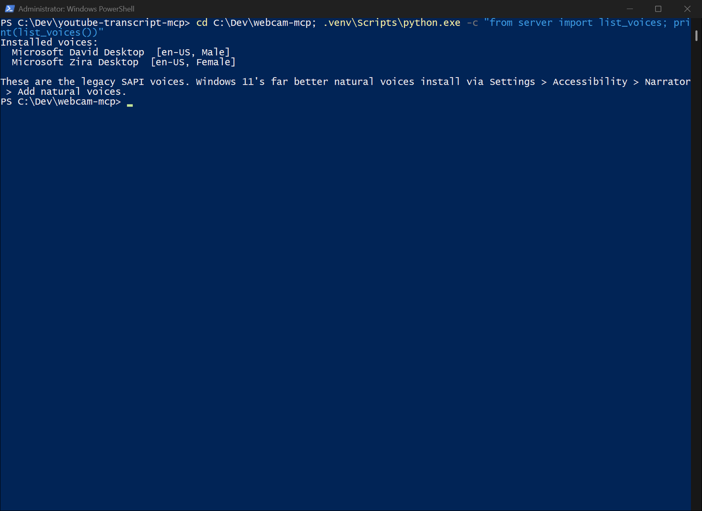

# webcam-mcp

MCP server giving coding agents eyes and ears: local webcam stills, mic transcription and speech replies.

[](LICENSE)
[](https://github.com/luigimasango-dev/webcam-mcp/actions/workflows/ci.yml)
[](https://www.python.org/downloads/)



## Quick start

Requires Python 3.11+, [uv](https://docs.astral.sh/uv/) and ffmpeg on PATH.
Tested 2026-09-11 from a fresh clone on Windows 11 (POSIX same, minus `py`):

```powershell
git clone https://github.com/luigimasango-dev/webcam-mcp.git
cd webcam-mcp
uv sync
uv run server.py --selftest
```

`--selftest` prints the device list without needing an MCP client — the
fastest way to confirm the install is sane. Without flags the server sits
waiting for MCP stdio input; appearing to do nothing until a client
connects is normal. Ctrl+C to exit.

## How it works

A coding agent that can read your screen but cannot see you or hear you is
missing a whole side of a conversation. This closes that gap for any MCP
client on a machine with a camera and a microphone.

Everything runs locally. ffmpeg captures frames, faster-whisper transcribes
on CPU, openWakeWord handles the wake word. No audio, video, transcript, or
image is sent anywhere. The only network call the server ever makes is a
one-time model download from Hugging Face the first time you transcribe
something.

## Tools

| Tool | Purpose | Key args |
|---|---|---|
| `list_devices` | Enumerate cameras and microphones. Call this first when a capture fails | — |
| `capture_frame` | One still JPEG from a camera. Returns a file path | `device`, `warmup_seconds=1.5`, `output_path` |
| `capture_stitched` | Two cameras in one image, first on top, second below | `top_device`, `bottom_device`, `warmup_seconds`, `width` |
| `record_audio` | Record a mic to 16kHz mono WAV. No transcription | `seconds`, `device`, `output_path` |
| `transcribe_file` | Transcribe any existing audio/video file to text, locally | `file_path`, `model_size="base"`, `language` |
| `record_and_transcribe` | Record the mic and return what was said. Blocks for the duration | `seconds`, `device`, `model_size`, `keep_audio=False` |
| `list_voices` | Text-to-speech voices installed on the machine | — |
| `speak` | Say something out loud, or render it to a WAV | `text`, `voice`, `rate=0`, `volume=100`, `save_to` |
| `listen_for_wake_word` | Wait for a wake phrase, then record and transcribe what follows | `timeout_seconds`, `record_seconds`, `threshold`, `device` |

Captures default to a temp folder with timestamped names. Pass
`output_path` to send them somewhere durable. `record_and_transcribe`
deletes its WAV afterwards unless you pass `keep_audio=True`. Nothing here
prunes old captures automatically — clear that folder occasionally.

## Limitations

- Warmup time is not padding. Webcams open dark and auto-exposure needs a
  moment; below about one second the frame comes back black or badly
  exposed. The default is 1.5 seconds for a reason.
- A failed capture is almost always a device already in use. Zoom, Teams,
  or a browser tab holding the camera produces an ffmpeg I/O error. The
  second most common cause is the OS privacy setting blocking desktop apps
  from the camera or microphone.
- Whisper `base` (the default) is the speed/accuracy sweet spot. `small` is
  meaningfully better on strong accents at roughly three times the compute.
  Models cache under the user profile after the first download, load lazily,
  and stay cached per size for the life of the server process.
- The default wake model is openWakeWord's pretrained `hey_jarvis`. At the
  default 0.5 threshold it is reliable; false positives are not a practical
  concern.
- `speak` uses the legacy SAPI voices by default. They sound robotic;
  OS natural voices run locally once installed and are picked up
  automatically.
- The honest architectural limit is the four-hop pipeline: speech to text,
  text to model, model to text, text to speech. Slower than a native audio
  model, and tone/volume/emotion are discarded before the model sees the
  words. Within a text MCP harness, four hops is the correct design.
- `capture_stitched` only earns its keep with a second camera connected;
  otherwise the second half is a connection spinner.

## Development

```powershell
uv sync
uv run --with pytest python -m pytest tests/ -v
```

The suite launches the real server over stdio, calls `tools/list`, and
asserts the nine tool names are present. No camera or mic is touched. Pin
`mcp>=1.28.1` but stay below 2.0 — mcp 2.x renamed `mcp.server.fastmcp`
and the import breaks at server start.

## License

MIT. See [LICENSE](LICENSE).
